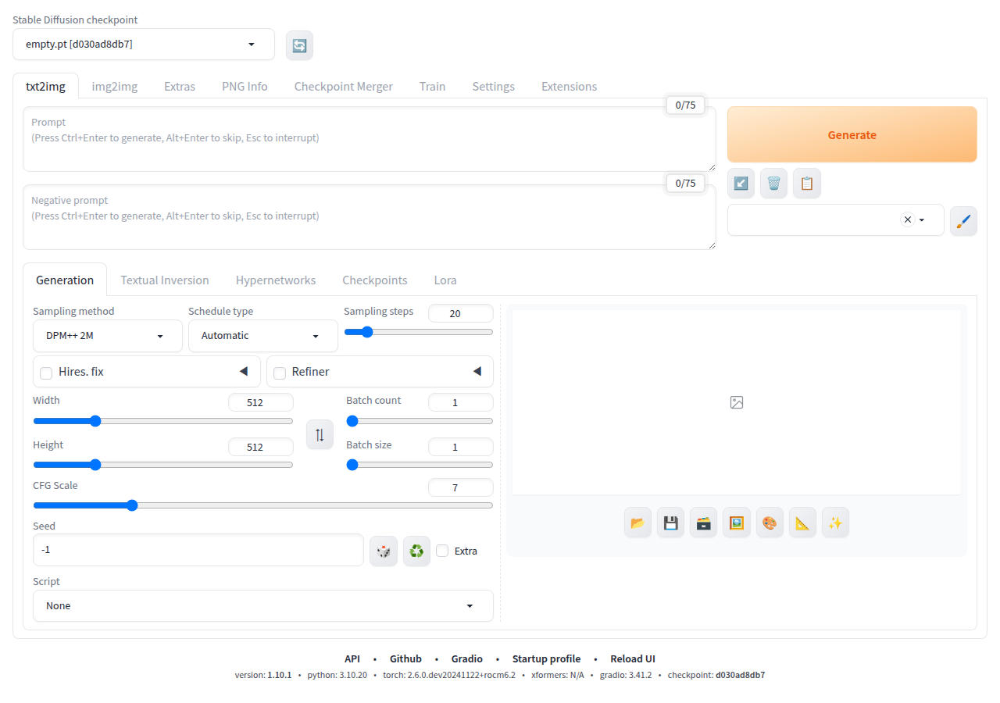

# Stable Diffusion WebUI — AMD Renoir fork

> Fork of [AUTOMATIC1111/stable-diffusion-webui](https://github.com/AUTOMATIC1111/stable-diffusion-webui) **v1.10.1**  
> Adds compatibility patches for AMD Renoir/Cezanne iGPU and a one-command run skill for headless environments.



---

## What this fork adds

| Change | Why |
|---|---|
| `venv` created from the `comfyui` conda env (Python 3.10 + `torch 2.6.0+rocm6.2`) | Reuses an existing ROCm-enabled PyTorch — no CUDA required |
| `webui-user.sh` — `python_cmd` set to comfyui Python 3.10 | Ensures the correct interpreter is used by `webui.sh` |
| `repositories/stable-diffusion-stability-ai` — cloned from `CompVis/stable-diffusion` with compatibility stubs | `Stability-AI/stablediffusion` was deleted from GitHub; these stubs fill in the missing API surface |
| `.claude/skills/run-stable-diffusion-webui/` — `setup.sh` + `smoke.sh` | One-command environment setup and headless smoke test |

### Compatibility stubs (for the deleted Stability-AI/stablediffusion repo)

The webui expects `Stability-AI/stablediffusion` (their SD2 fork) which no longer exists. The `CompVis/stable-diffusion` repo is used instead, with the following stubs committed directly into `repositories/stable-diffusion-stability-ai/`:

| File | Stubs |
|---|---|
| `ldm/modules/midas/__init__.py` + `api.py` | MiDaS depth estimation API (`ISL_PATHS`, `load_model`) |
| `ldm/data/util.py` | `AddMiDaS` preprocessing transform |
| `ldm/models/diffusion/ddpm.py` | `LatentDepth2ImageDiffusion`, `LatentInpaintDiffusion` |
| `ldm/modules/attention.py` | `ATTENTION_MODES` dict on `BasicTransformerBlock` |

**Impact:** depth-guided img2img (SD2 depth model) is not available. Everything else — txt2img, standard img2img, LoRA, extras, extensions — works normally.

---

## Hardware

- **CPU:** AMD Cezanne (Ryzen 5000 series)
- **GPU:** AMD Renoir/Cezanne integrated GPU (Radeon Vega, `HSA_OVERRIDE_GFX_VERSION=9.0.0`)
- **PyTorch:** `2.6.0.dev+rocm6.2` (ROCm 6.2, from the `comfyui` conda env)
- Runs **CPU-only** for testing; set `HSA_OVERRIDE_GFX_VERSION=9.0.0` for ROCm

---

## Quick start

### 1. One-time setup

```bash
bash .claude/skills/run-stable-diffusion-webui/setup.sh
```

This creates the venv, installs all dependencies, and clones the required repositories.

### 2. Smoke test (headless)

```bash
bash .claude/skills/run-stable-diffusion-webui/smoke.sh
# Screenshot → /tmp/sdwebui-screenshot.png
```

Launches the server with the empty test checkpoint (no model download), runs curl checks, takes a screenshot, and shuts down cleanly.

### 3. Run interactively

```bash
HSA_OVERRIDE_GFX_VERSION=9.0.0 \
  venv/bin/python launch.py \
    --skip-prepare-environment \
    --skip-torch-cuda-test \
    --skip-python-version-check \
    --no-half \
    --use-cpu all \
    --do-not-download-clip \
    --port 7860
```

Open **http://127.0.0.1:7860** in your browser.  
On first run without `--ckpt`, it downloads `v1-5-pruned-emaonly.safetensors` (~4 GB). To skip that during testing add `--ckpt test/test_files/empty.pt`.

---

## Known issues

- **`--api` flag crashes** — FastAPI 0.94 + starlette 0.26 raise `RuntimeError: Cannot add middleware after an application has started`. Don't pass `--api`; the Gradio queue and info routes still work.
- **Depth-guided img2img** — Not available (see stub table above).
- **`xformers` not installed** — Not needed for CPU/ROCm; the webui falls back to standard attention automatically.

---

## Original project

All credit for the webui itself goes to [AUTOMATIC1111](https://github.com/AUTOMATIC1111/stable-diffusion-webui) and its contributors.  
This fork only adds environment-specific patches and tooling; it does not modify any generation logic.

For upstream features, installation on other platforms, and the full wiki, see:  
➜ https://github.com/AUTOMATIC1111/stable-diffusion-webui
